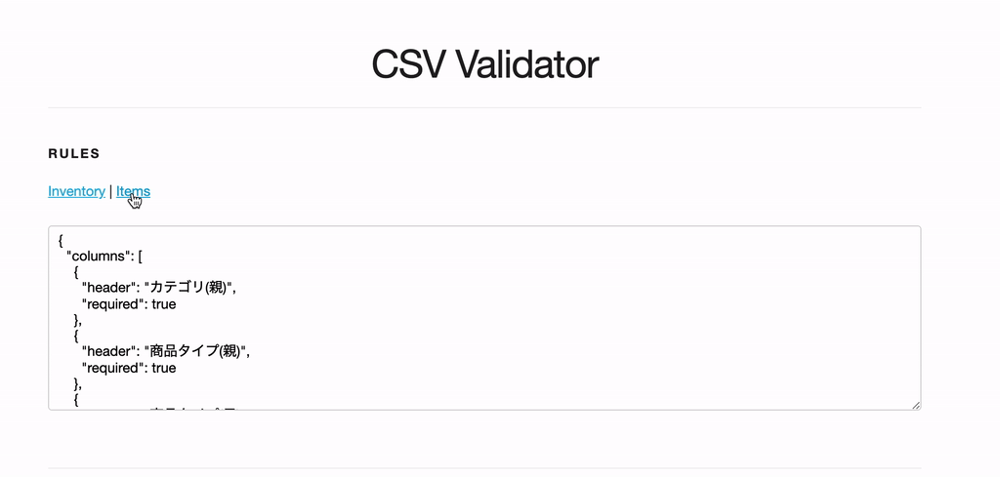
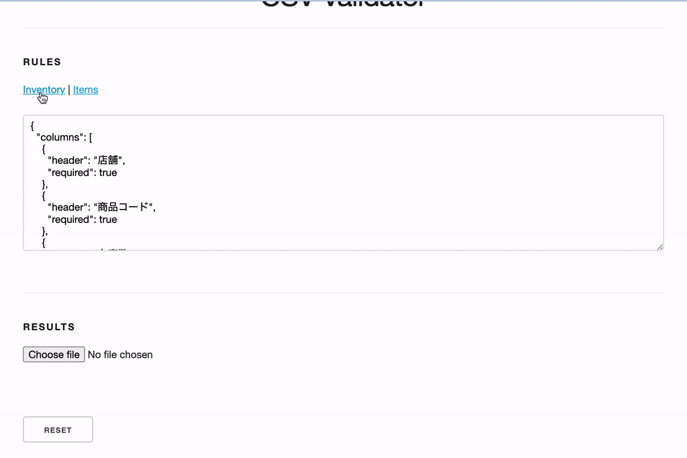

# csv-validator

Tiny project that accepts a CSV, validates columns based on a set of rules and spits out an import example.

## run it

just open the [index.html](index.html) and you should be good to go.

## usage

### rules

Before running the validation of a CSV you can manually specify the rules to check or choose one of the preselected options. This far, only one things is checked which is the existance of a column or not by looking at the CSVs first line headers. The next step of this would be to validate the contents of each column such as if it contains links or numbers.



### validation

Once a ruleset is chosen, simply pick your CSV. The errors will be displayed as a bullet list of missing columns or the file will be sampled to show a number of example lines.



## live reload

To debug the html contents, it's easiest to use the `livereload` plugin. The snippet is automatically added to the layout header unless running in `production` environment.

```
npm install -g livereload
livereload
```